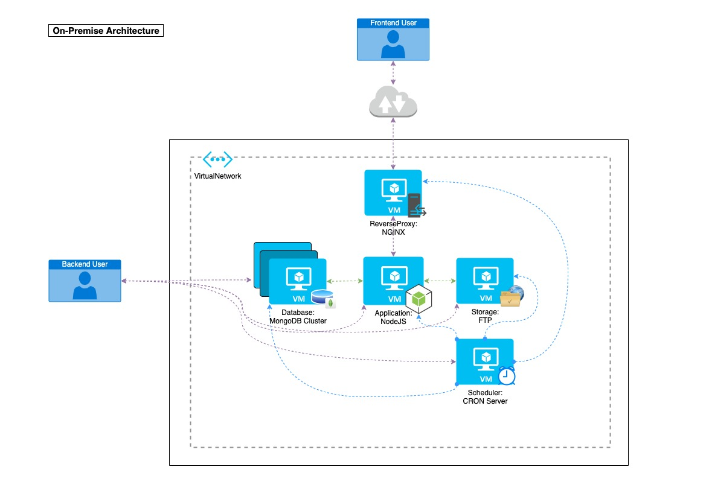
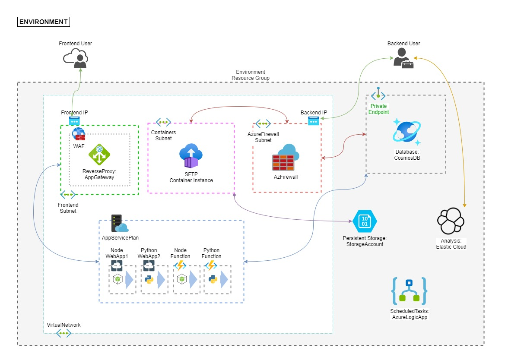
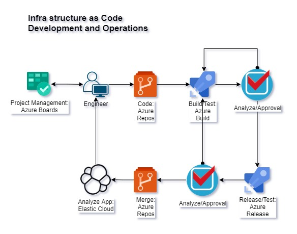
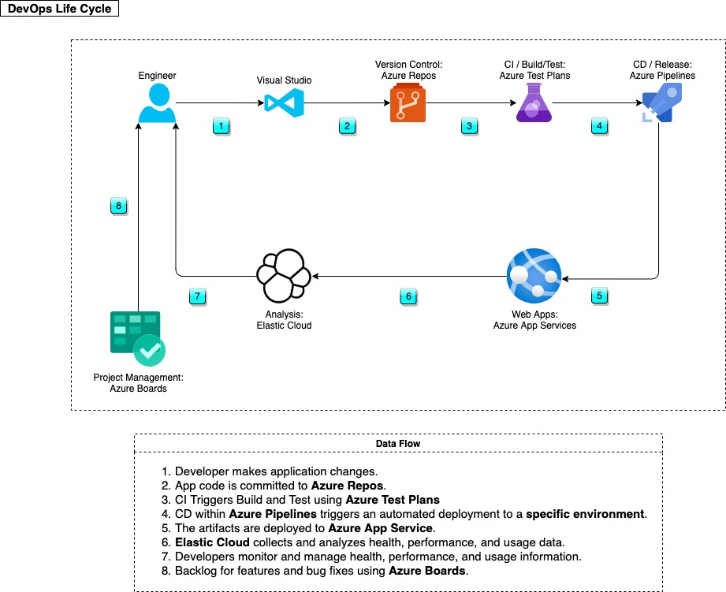

# Secured, Scalable, Highly Available App Service Solution

## Table of Contents

- [Secured, Scalable, Highly Available App Service Solution](#secured-scalable-highly-available-app-service-solution)
  - [Table of Contents](#table-of-contents)
  - [Assignment](#assignment)
    - [Transformation and Migration to the Public Cloud](#transformation-and-migration-to-the-public-cloud)
    - [Solution Constraints](#solution-constraints)
  - [On-premise Infrastructure](#on-premise-infrastructure)
  - [Cloud Infrastructure](#cloud-infrastructure)
  - [Infrastructure as Code](#infrastructure-as-code)
  - [Infrastructure CI/CD](#infrastructure-cicd)
    - [Preparation](#preparation)
    - [Build Pipeline Stages and Tasks](#build-pipeline-stages-and-tasks)
    - [Release Pipeline Stages and Tasks](#release-pipeline-stages-and-tasks)
    - [Test Plan](#test-plan)
  - [Application CI/CD](#application-cicd)
  - [Contribute](#contribute)

## Assignment

### Transformation and Migration to the Public Cloud

Client wants to migrate their on-premise NodeJS Application to the Cloud.
Cost is not a problem.
Data processed is sensitive.
Traffic is average.
Use ELK for logs.

### Solution Constraints

Must be/have:

- Flexible.
- Scalable.
- On Azure Managed Services.
- Migrated using modern technologies in terms of infra.
- Secure connection.

---

## On-premise Infrastructure

- Customer facing NodeJS application behind an NGINX reverse proxy.
- MongoDB cluster for storing data.
- FTP server for document storage.
- A cron server, mostly Bash and Python scripts, for small tasks with low interval.
- All are hosted on several virtual machines.

---

## Cloud Infrastructure

The old NodeJS Application will be broken down to App Services that will have their own lifecycle. `Idealy, App Services and Functions will be hosted in an Azure Service Environment.`

The MongoDB Server will be migrated to CosmosDB using Azure CosmosDB API for MongoDB. `Idealy, CosmosDB will be have a secondary location.`

I. Network

- Virtual Network
- App Gateway with WAF - Frontend Access
- Azure Firewall - Backend access
- Private Endpoint - For Internal application communication

II. Application

- App Service Environment (`Ideal`)
- App Service Plan - Inside in an `ASE` or just Azure Premium Hosting
- App Services (NodeJS) - Accessible via App Gateway
- App Services (Python) - Accessible via App Gateway

III. Storage

- Storage Account
  - Fileshare as File Storage
- Container Instance
  - On-demand FTP Server

IV. Database

- Azure Cosmos DB API for MongoDB
  - With Private endpoint
  - Accessible only via Firewall endpoints

V. Scheduler

- Azure Logic Apps
- Azure Functions (Python/Powershell/Node)

VI. Analysis

- Azure Elastic Cloud

---

## Infrastructure as Code

Infrastructure will be provisioned in Azure using Azure Bicep.
CI/CD will be implemented for the infrastructure as well.

## Infrastructure CI/CD

### Preparation

1. Provide the correct `parameters.json`.
1. Provide the intended `endpoint-ssl.pfx` file for the domain.

### Build Pipeline Stages and Tasks

1. Verification
    1. Pipeline to check if intended Environment matches the `parameters.json`
1. Test the code
    1. Use Bicep's `what-if` command

### Release Pipeline Stages and Tasks

1. Test the code
    1. Use Bicep's `what-if` command
1. Approval Gate
1. Deploy the code
    1. Use Bicep's `create` command
1. Test the code
    1. Deploy sample codes for the initial apps
    1. Connect to the Private and Public Endpoints to check Accessibility

---

## Application CI/CD

Azure DevOps will be utilized.

1. Developer makes application changes.
1. App code is committed to Azure Repos.
1. CI Triggers Build and Test using Azure Test Plans
1. CD within Azure Pipelines triggers an automated deployment to a specific environment.
1. The artifacts are deployed to Azure App Service.
1. Elastic Cloud collects and analyzes health, performance, and usage data.
1. Developers monitor and manage health, performance, and usage information.
1. Backlog for features and bug fixes using Azure Boards.

## Contribute

If you want to learn more about creating good readme files then refer the following [guidelines](https://docs.microsoft.com/en-us/azure/devops/repos/git/create-a-readme?view=azure-devops). You can also seek inspiration from the below readme files:

- [ASP.NET Core](https://github.com/aspnet/Home)
- [Visual Studio Code](https://github.com/Microsoft/vscode)
- [Chakra Core](https://github.com/Microsoft/ChakraCore)
